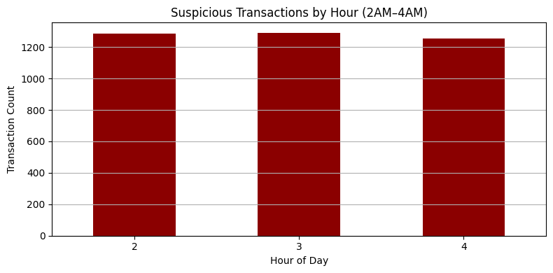
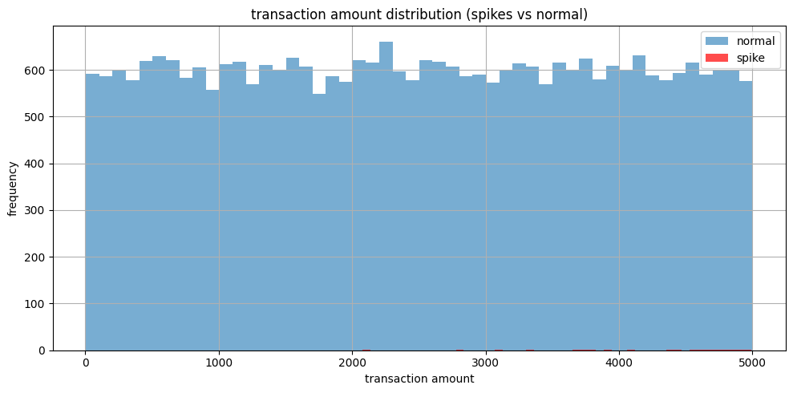
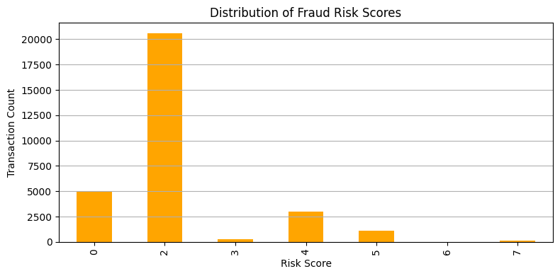
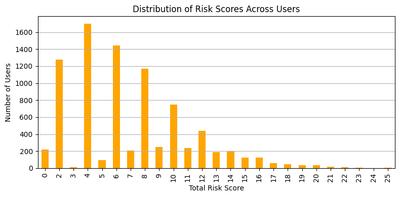

# Fraud Detection Analysis Using Python and SQL

## Overview

This project was a passion-driven deep dive into fraud analytics. As a data analyst, I'm always looking to uncover patterns in messy datasets and tell clear, compelling stories through data. This case study allowed me to simulate real-world fraud detection logic by applying rule-based strategies, SQL queries, and Python workflows to identify suspicious behavior.

Working on this project not only sharpened my technical skills, but reinforced how powerful data can be in driving smarter, faster decisions in high-risk industries like finance.

## Objective

The goal was to detect potentially fraudulent transactions from a dataset using clear, rule-based logic and explore patterns using pandas, SQL, and matplotlib. I implemented **7 fraud detection rules**, then assigned composite risk scores to highlight high-priority users for investigation.

## Dataset

- `fraud_detection_transactions.csv`  
  Contains 30,000+ transactions with timestamps, user IDs, amounts, device IDs, and refund flags.

## Rules Implemented

| Rule # | Fraud Pattern Detected                     | Description |
|--------|---------------------------------------------|-------------|
| 1      | High-frequency transactions                 | >5 transactions by the same user in 1 hour |
| 2      | Transactions between 2AM–4AM                | Unusual, bot-like hours |
| 3      | Refund-heavy behavior                       | >3 refunds by user in a calendar month |
| 4      | Shared device usage                         | Devices used by 5+ different users |
| 5      | High transaction amount spikes              | Transactions 3x above user's average |
| 6      | Composite risk scoring                      | Weighted score combining red flags |
| 7      | Top high-risk users                         | Users with score ≥ 5 flagged for review |

---

## Key Visualizations

### 1. Suspicious Transactions by Hour  
Shows abnormal volume of transactions during 2–4AM.  

### 2. Transaction Amount Distribution (Normal vs Spike)  
Users with unusually high amounts appear far right in red.  

### 3. Risk Score Distribution  
Most transactions score low; some trigger 5+ based on rules.  

### 4. Risk Score per User  
Highlights users with repeated suspicious behaviors.  

## Outputs

CSV files were generated for each flagged rule and saved to the `/data` folder:

- `high_frequency_users.csv`
- `unusual_time_transactions.csv`
- `refund_heavy_users.csv`
- `shared_device_users.csv`
- `amount_spike_users.csv`
- `high_risk_users.csv`

## Reflections

This project pushed me to combine multiple skills — from SQL querying and datetime wrangling to data visualization and risk scoring. I enjoyed building a fraud detection pipeline from scratch and learned how simple rules can scale into powerful decision tools.

## Tools Used

- Python (pandas, matplotlib, sqlite3)
- SQL (SQLite queries)
- Jupyter Notebooks
- Visual Studio Code
